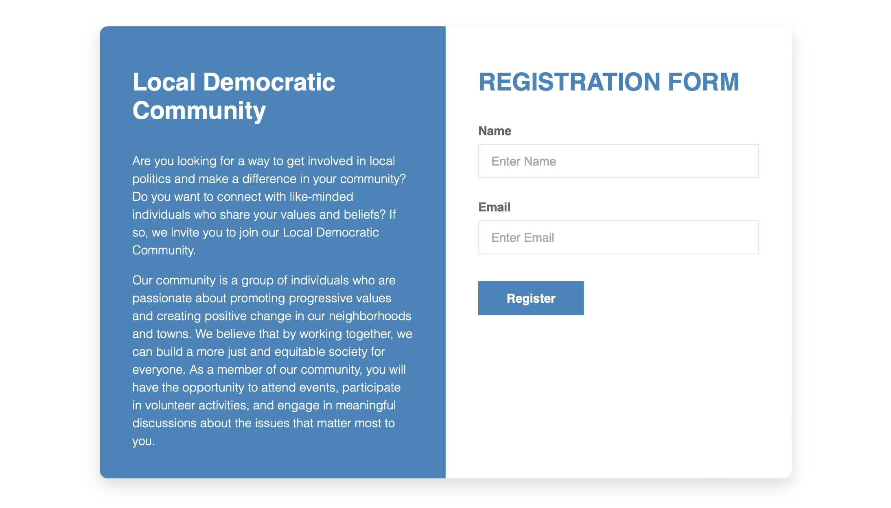

# Recruiters.jl

Recruiter is an optional service that enables small communities to organise recruitment of new members to PeaceFounder. An email is used for identification mechanisms and confidential channels to which a deme registration invite is sent. That is then pasted into the PeaceFounder application on a local device, ensuring correct private key generation and registration to the braidchain to become a fully functional member.




## API

To use the Recruiter, you first need to set up a PeaceFounder deme with a recruiter (done by default), from which you need to obtain the:

- A `KEY` and a `HASH` function are used for authorisation operations 
- The internet location `URL` to the deme

The second ingredient is an SMTP service which enables to send off emails by a trusted email provider. Unfortunately, many popular email providers like GMAIL, Outlook and others have discontinued their SMTP services in the name of two-factor authentification. Those who still do support SMTP tend to be outcasted as junk when BIG providers receive emails from them. Thus getting SMTP can take a little bit of research to work. The ingredients you need explicitly are:

- SMTP service location like `smtps://mail.inbox.lv:465`
- Email address and password

```julia
RECRUIT_ROUTE = Recruiters.Route("http://127.0.0.1:80")
RECRUIT_HMAC = Recruiters.HMAC("RECRUIT_KEY", "SHA-256")

SMTP = "smtps://mail.inbox.lv:465" 
EMAIL = "demerecruit@inbox.lv"
EMAIL_PASSWD = "EMAIL_PASSWORD"

title = "Local Democratic Community"
pitch = """
<p> Are you looking for a way to get involved in local politics and make a difference in your community? Do you want to connect with like-minded individuals who share your values and beliefs? If so, we invite you to join our Local Democratic Community.</p>

<p> Our community is a group of individuals who are passionate about promoting progressive values and creating positive change in our neighborhoods and towns. We believe that by working together, we can build a more just and equitable society for everyone. As a member of our community, you will have the opportunity to attend events, participate in volunteer activities, and engage in meaningful discussions about the issues that matter most to you.</p>
"""

Recruiters.serve(RECRUIT_ROUTE, RECRUIT_HMAC, SMTP, EMAIL, EMAIL_PASSWD; title, pitch)
```

And this is it! You can choose to host it with the deme or on a separate server instance. 

## Security considerations

It is fine to host the Recruiter on a dynamic IP address without a certificate as long as the information provided in the form plus the IP address is not considered sensitive or attainable to a potential eavesdropper. Nevertheless, you may opt for an SSL certificate to avoid scaring users away when the browser informs them that the site is unsecured. 

There is also no need to have a confidential connection with the deme server as the token is computed with the `KEY` at both endpoints without ever being transmitted. 

## Further work

It is fairly possible that there already is a protocol specification which uses HMAC in the same way as I have done so. It would be great then to comply with the specification to analyse implementation easier.

